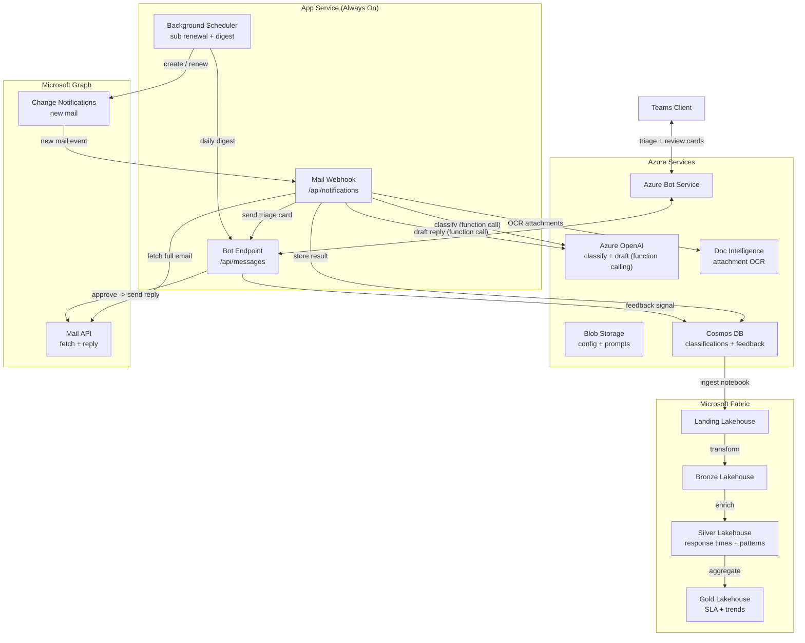

# Email Triage Agent

AI-powered email triage bot for Microsoft Teams. Monitors shared mailboxes via Graph subscriptions, classifies incoming emails with OpenAI function calling, auto-drafts replies for review, and feeds email analytics into a Microsoft Fabric medallion pipeline for classification accuracy tracking, response time SLA monitoring, and topic trend analysis.

## Architecture



## Core Flows

### Flow 1 -- Mail Notification Pipeline

1. Graph subscription fires a webhook when new email arrives in a monitored mailbox
2. Webhook handler fetches full email content + metadata via Graph Mail API
3. If attachments exist, OCR them via Azure AI Document Intelligence (prebuilt-read)
4. Call Azure OpenAI with **function calling** tool `classify_email` returning structured fields:
   - `classification` (urgent / needs_reply / fyi / spam)
   - `urgency` (critical / high / medium / low)
   - `topic` (auto-extracted category)
   - `sentiment` (positive / neutral / negative / angry)
   - `requires_attachment_review` (boolean)
   - `confidence` (0-1)
   - `reasoning` (explanation)
5. Store classification result in Cosmos DB
6. Send triage Adaptive Card to configured users via Teams

### Flow 2 -- Auto-Draft + Review

For emails classified as `needs_reply`:

1. Call OpenAI with **function calling** tool `draft_reply` returning:
   - `subject`, `body`, `tone` (formal / friendly / concise), `key_points_addressed`
2. Store draft alongside the classification in Cosmos
3. Send Draft Review Adaptive Card with three actions:
   - **Approve & Send** -- sends reply via Graph, records `approved` feedback
   - **Edit & Send** -- sends user's edited text, records `edited` feedback
   - **Reject** -- discards draft, records `rejected` feedback for accuracy tracking

### Flow 3 -- Daily Digest

Scheduled at 17:00 UTC, aggregates the day's triage results per mailbox:
- Email count by classification (urgent, needs-reply, FYI, spam)
- Response rate for needs-reply emails
- Outstanding items awaiting review

### Flow 4 -- Bot Commands

| Command   | Description                                   |
|-----------|-----------------------------------------------|
| `inbox`   | Show today's triage summary                   |
| `pending` | List emails awaiting draft review             |
| `stats`   | Classification accuracy and response metrics  |
| `refresh` | Force-reload mailbox config from blob         |

### Flow 5 -- Fabric Analytics Pipeline

| Notebook             | Stage   | Description                                                   |
|----------------------|---------|---------------------------------------------------------------|
| `01_ingest_main`     | Landing | Cosmos DB records into Landing lakehouse                      |
| `02_transform_main`  | Bronze  | Normalize, type cast, deduplicate                             |
| `03_enrich_main`     | Silver  | Response time calculation, accuracy flags, temporal features  |
| `04_aggregate_main`  | Gold    | Inbox metrics, classification accuracy, SLA compliance, topic trends |

**Fabric Workspace Structure:**

```
notebooks/
  main/
    01_ingest_main
    02_transform_main
    03_enrich_main
    04_aggregate_main
  modules/
    config_module
    utils_module
lh_email_landing             ← raw Cosmos snapshots
lh_email_bronze              ← normalized, deduplicated
lh_email_silver              ← enriched with response times + patterns
lh_email_gold                ← SLA metrics, trends, accuracy
```

**Gold Tables:**

- `inbox_metrics` -- daily email counts by classification per mailbox
- `classification_accuracy` -- feedback-based accuracy rates per classification type
- `response_time_sla` -- % within SLA target by urgency level
- `topic_trends` -- email volume by topic over weeks

## Project Structure

```
EMAIL-TRIAGE-AGENT/
  deploy/
    deploy.config.toml              # Infrastructure configuration
    deploy-infra.ps1                # Idempotent: RG, Storage, Cosmos, App Service, OpenAI, Doc Intel, Bot, Entra, RBAC
    deploy-app.ps1                  # ZIP-deploy, seed config + prompts, build manifest
    deploy-fabric.ps1               # Fabric lakehouses + notebooks
    assets/
      config/
        mailbox_config.json.example # Monitored mailbox definitions
      prompts/
        classify.txt                # Classification system prompt
        draft_reply.txt             # Draft reply system prompt
      notebooks/
        modules/                    # Shared Fabric notebook modules
        main/                       # Fabric pipeline notebooks (01-04)
  src/
    app.py                          # aiohttp entry: bot + webhook + scheduler
    bot.py                          # ActivityHandler: draft review + commands
    config.py                       # Settings from environment variables
    graph/                          # MSAL auth, mail API, Graph subscriptions
    services/                       # Classifier, drafter (function calling), OCR, Cosmos, prompts
    cards/                          # Adaptive Card builders (triage, draft, digest)
    background/                     # Subscription renewal + daily digest scheduler
    webhooks/                       # Graph mail notification processing pipeline
  manifest/                         # Teams app manifest + icons
  requirements.txt
```

## OpenAI Function Calling

This project uses OpenAI function calling (tool use) for guaranteed structured outputs:

**`classify_email`** -- Returns classification, urgency, topic, sentiment, confidence, and reasoning as typed fields. The model is forced to call this function via `tool_choice`.

**`draft_reply`** -- Returns subject, body, tone, and key points addressed. Only invoked for emails classified as `needs_reply`.

Both tools use low temperature (0.1 for classification, 0.4 for drafting) for deterministic, high-quality outputs.

## Configuration

### Infrastructure (`deploy/deploy.config.toml`)

All Azure resource names, SKUs, Cosmos DB settings, Doc Intelligence, and Fabric workspace references. Leave name fields empty to auto-derive from `naming.prefix`.

### Mailboxes (`deploy/assets/config/mailbox_config.json`)

Runtime configuration for monitored mailboxes -- seeded to blob by `deploy-app.ps1`:

```json
[
  {
    "mailbox": "shared-inbox@contoso.com",
    "display_name": "Shared Inbox",
    "notify_user_upns": ["admin@contoso.com"],
    "auto_draft": true,
    "rules": {
      "skip_senders": ["noreply@contoso.com"],
      "always_urgent_senders": ["ceo@contoso.com"]
    }
  }
]
```

## Deployment

### Prerequisites

- Azure CLI (`az`) authenticated
- Python 3.11+
- PowerShell 7+

### Steps

```powershell
# 1. Edit configuration
notepad deploy/deploy.config.toml
copy deploy/assets/config/mailbox_config.json.example deploy/assets/config/mailbox_config.json
notepad deploy/assets/config/mailbox_config.json

# 2. Deploy infrastructure
.\deploy\deploy-infra.ps1

# 3. Deploy application + seed config + prompts
.\deploy\deploy-app.ps1

# 4. Deploy Fabric pipeline (optional -- lakehouses, folders, notebooks)
.\deploy\deploy-fabric.ps1

# 5. Upload teams-manifest.zip via Teams Admin Center
```

### Graph API Permissions (Application)

| Permission             | Purpose                              |
|------------------------|--------------------------------------|
| `Mail.Read`            | Read email content from mailboxes    |
| `Mail.Send`            | Send approved draft replies          |
| `User.Read.All`        | Resolve user profiles                |
| `ChannelMessage.Send`  | Post to Teams channels (optional)    |

Grant these in the Azure Portal under **Entra ID > App registrations > API permissions**.

## Cosmos DB Schema

Database: `email-triage`, Container: `emails` (partition key: `/mailbox`)

Each document stores the full triage lifecycle: classification fields, optional draft, feedback signal, and response timestamp.
